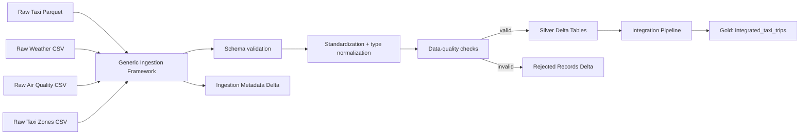

## Task 2 — Storage Architecture

### 2.1 Directory structure

The platform uses a small lakehouse layout based on three logical layers:

```text
<output_root>/
├── bronze/
│   └── ...                         # optional raw landing/copies
├── silver/
│   ├── taxi_trips/                 # validated standardized Delta table
│   ├── weather/                    # validated standardized Delta table
│   ├── air_quality/                # validated standardized Delta table
│   └── taxi_zones/                 # validated standardized Delta table
├── gold/
│   └── integrated_taxi_trips/      # final enriched analytical table
└── metadata/
    ├── ingestion_runs/             # ingestion statistics and schema version
    └── rejected_records/
        ├── taxi_trips/
        ├── weather/
        ├── air_quality/
        └── taxi_zones/
```

The original files remain the source of truth for raw ingestion. The **Silver** layer contains one standardized Delta table per dataset. The **Gold** layer contains analytical outputs produced by joining standardized datasets.

### 2.2 Delta table organization

| Dataset | Layer | Delta table | Partitioning |
|---|---|---|---|
| Taxi trips | Silver | `silver/taxi_trips` | `pickup_year`, `pickup_month` |
| Weather | Silver | `silver/weather` | none |
| Air quality | Silver | `silver/air_quality` | `observation_year`, `observation_month` |
| Taxi zone lookup | Silver | `silver/taxi_zones` | none |
| Integrated taxi trips | Gold | `gold/integrated_taxi_trips` | `pickup_year`, `pickup_month` |
| Ingestion metadata | Metadata | `metadata/ingestion_runs` | none |
| Rejected rows | Metadata | `metadata/rejected_records/<dataset>` | none |

Delta is used because it gives a consistent table abstraction over files and supports schema tracking, atomic writes, and future incremental updates.

### 2.3 Naming conventions

The common naming rules are:

- all column names are lowercase `snake_case`;
- table names are descriptive plural nouns;
- canonical timestamps end with `_timestamp_utc`;
- hourly join keys end with `_hour_utc`;
- calendar partition columns use `*_year` and `*_month`;
- boolean data-quality or availability indicators use names such as `weather_available`.

### 2.4 Lookup tables

The taxi zone dataset is conceptually a **lookup table** because it maps a stable identifier (`location_id`) to descriptive attributes such as borough and zone.
Weather and air quality are not lookup tables. They are time-varying observation tables. Taxi trips are the central fact table.

### 2.5 Which datasets should not be partitioned?

`taxi_zones` should not be partitioned because it is very small and almost static. Partitioning it would create unnecessary directories and small files without reducing query cost.

`weather` is also left unpartitioned in the current implementation. It contains only one row per hour for the covered location and is therefore much smaller than the taxi fact table. Partitioning it by month would provide little benefit at the current scale and would increase file-management overhead.

### 2.6 Different partitioning strategies

The datasets have different access patterns:

- **Taxi trips:** partitioned by pickup year and month. The table is large and analyses frequently filter by time.
- **Air quality:** partitioned by observation year and month. The table grows continually and contains multiple sites/pollutants per time period.
- **Weather:** unpartitioned because it is comparatively small.
- **Taxi zones:** unpartitioned because it is a small lookup table.
- **Integrated taxi trips:** partitioned like taxi trips because it has one row per trip and similar query patterns.

Partitioning by day was deliberately avoided in the base design. Monthly partitions keep the number of partitions manageable while still allowing useful partition pruning.

### 2.7 When partitioning becomes harmful

Partitioning is harmful when a partition key has too many distinct values or when each partition contains too little data. This produces many small files and directories, which increases metadata and scheduling overhead.

Bad examples would be partitioning taxi trips by:

- `trip_id`,
- exact pickup timestamp,
- pickup zone if the dataset is not large enough,
- day/hour at small scale.

A useful rule is that partitioning should reduce the amount of data read while still leaving reasonably large files inside each partition.

### 2.8 Design at 20x data volume

At 20x the current volume, the logical design can remain unchanged, but the physical layout should become more aggressive:

1. Keep taxi and integrated tables partitioned by year/month.
2. Consider year/month/day partitioning only if monthly partitions become very large and queries commonly restrict to individual days.
3. Compact small files periodically.
4. Use Delta optimization features available in the execution environment.
5. Use incremental ingestion instead of overwriting complete tables.


### 2.9 Architecture diagram



---

## Task 3 — Generic Ingestion Framework

### 3.1 Overview

The ingestion framework is driven by `DatasetSpec` objects. A dataset specification declares:

- source format;
- input path;
- required source columns;
- primary-key definition used for validation;
- partition columns;
- dataset-specific transformation function;
- dataset-specific numeric range checks.

The generic ingestion sequence is:

```text
load raw file
    ↓
standardize column naming
    ↓
validate required schema
    ↓
write unmodified copy to Bronze (Delta)
    ↓
normalize nulls, types and timestamps
    ↓
apply dataset-specific transformations
    ↓
run quality checks
    ↓
split valid / rejected rows
    ↓
write valid rows as Silver Delta
    ↓
write rejected rows + reasons
    ↓
append ingestion metadata
```

The Bronze write is a genuine landing step, not just reserved directory space: it persists the raw, standardized-but-untransformed rows as Delta immediately after schema validation, so ingestion can be reproduced or re-transformed later even if the original source file is rotated or deleted upstream. It is intentionally the *only* generic step besides Silver writing that touches storage — it never runs dataset-specific logic.

### 3.2 Generic and reusable components

The following components are fully generic:

- CSV/Parquet loading;
- raw schema validation;
- column-name standardization;
- textual null normalization;
- common type-casting helper;
- UTC timestamp convention;
- primary-key null checks;
- duplicate primary-key detection;
- numeric range checks;
- valid/rejected row split;
- Delta writing;
- ingestion metadata generation.

The same ingestion function is used for every dataset:

```python
ingest_dataset(spark, spec, output_root)
```

### 3.3 Dataset-specific components

Some logic must remain dataset-specific because the source semantics differ.

#### Taxi trips

The taxi transformation:

- parses pickup/dropoff timestamps;
- converts New York local timestamps to UTC;
- creates a deterministic synthetic `trip_id`, because the source contains no guaranteed primary key;
- derives `pickup_hour_utc`, `pickup_year`, `pickup_month`;
- derives `trip_duration_seconds`.

#### Weather

The weather transformation:

- combines `year`, `month`, `day`, and `hour` into one timestamp;
- interprets that timestamp in the New York timezone;
- converts it to canonical UTC;
- converts measurement columns to numeric types.

#### Air quality

The air-quality transformation:

- combines `date_local` and `time_local`;
- normalizes the timestamp to UTC;
- creates an hourly join key;
- preserves pollutant, station, method, coordinate, and measurement attributes.

#### Taxi zones

The taxi-zone transformation mainly standardizes names and casts `location_id` to an integer.

These differences cannot be made completely generic without either losing semantic correctness or creating an overly complex configuration language.

### 3.4 Transformation-rule definition and maintenance

Dataset-specific rules are registered in a `DatasetSpec`.

For example:

```python
DatasetSpec(
    name="air_quality",
    file_format="csv",
    required_columns=[...],
    primary_key=[...],
    partition_cols=["observation_year", "observation_month"],
    transform=transform_air_quality,
)
```

The generic framework never contains dataset-name-specific parsing code. This keeps orchestration reusable while placing semantic transformations in small dedicated functions.

### 3.5 Schema validation

Validation occurs before transformations. If required source columns are missing, ingestion fails immediately with an explicit error.

This is preferable to silently producing null columns because schema changes in upstream systems should be visible to the pipeline operator.

### 3.6 Data-quality checks

The framework checks:

- missing primary-key values;
- duplicated primary keys;
- invalid/null normalized timestamps;
- numeric values outside configured domains;
- dropoff earlier than pickup;
- non-positive trip duration.

Rejected rows are written to:

```text
metadata/rejected_records/<dataset>
```

Each rejected row has a `rejection_reasons` array, allowing multiple detected problems to be reported at once.

### 3.7 Taxi-trip primary key

The taxi dataset contains no source attribute guaranteed to uniquely identify a trip. The implementation therefore constructs a deterministic SHA-256 hash from the normalized record and calls it `trip_id`.

This is a practical ingestion key rather than a claim that the source has a real natural primary key. It is useful for detecting exact duplicate records and avoiding ambiguity in the common model.

### 3.8 Ingestion metadata

Each ingestion run appends one row to:

```text
metadata/ingestion_runs
```

The row contains:

- dataset name;
- source path;
- number of processed valid records;
- number of rejected records;
- execution time;
- schema version;
- ingestion timestamp.

This provides an audit trail and allows basic ingestion monitoring.

### 3.9 Reducing duplication and simplifying maintenance

Code duplication is reduced by separating:

1. **generic pipeline mechanics**, implemented once;
2. **dataset configuration**, declared in `DatasetSpec`;
3. **dataset semantics**, isolated in transformation functions.

Adding a new file format would require extending `load_raw`. Adding a new dataset with an already supported format normally requires only one new configuration entry plus one transformation function.

### 3.10 Adding 20 new datasets

If the municipality adds 20 datasets, the framework does not need to be redesigned.

For each new dataset we would:

1. define a `DatasetSpec`;
2. specify required columns and primary key;
3. define a transformation function when necessary;
4. define partitioning and quality rules;
5. add the dataset to the ingestion configuration.

The generic validation, metadata, rejection, naming, and Delta-writing logic remains unchanged.

---

## Task 4 — Common Data Model

### 4.1 Timestamp standard

All canonical timestamps use Spark `TimestampType` and are normalized to **UTC**.

Source data is interpreted in `America/New_York` when it is provided as a New York local time. The Spark session itself is configured with:

```text
spark.sql.session.timeZone = UTC
```

Canonical examples:

```text
pickup_timestamp_utc
dropoff_timestamp_utc
observation_timestamp_utc
observation_hour_utc
```

Hourly joins use a timestamp truncated to the hour rather than separate integer year/month/day/hour columns.

### 4.2 Why UTC?

UTC gives every dataset the same temporal reference and prevents joins from depending on machine-local Spark settings.

It also makes the common model usable for future datasets that may already provide UTC timestamps.

A limitation is that source local timestamps around daylight-saving transitions can be ambiguous if the source itself does not contain an offset.

### 4.3 Column naming

All columns are converted to lowercase `snake_case`.

This removes differences such as:

```text
PULocationID
Date Local
Sample Measurement
```

and yields:

```text
pulocation_id
date_local
sample_measurement
```

### 4.4 Missing values

Missing values are represented using SQL `NULL`.

For string columns, the ingestion layer converts common textual markers such as:

```text
""
"NA"
"N/A"
"null"
"None"
"NaN"
"-"
```

to actual nulls.

Missing contextual observations during integration are **not imputed**. The taxi row is preserved through left joins, contextual columns stay null, and explicit indicators such as `weather_available` and `air_quality_available` show whether the context was present.

This avoids inventing measurements that do not exist in the source.

### 4.5 Common data types

The platform uses the following general types:

| Semantic type | Spark type |
|---|---|
| timestamps | `TimestampType` |
| dates | `DateType` |
| integer identifiers/codes | `IntegerType` or `StringType` when leading zeros may matter |
| physical measurements | `DoubleType` |
| money | `DoubleType` in this assignment implementation |
| categorical labels | `StringType` |
| availability flags | `BooleanType` |
| dynamic pollutant measurements | `MapType(StringType, DoubleType)` |

For a production financial system, decimal types would be preferable for money, but `DoubleType` is sufficient for this analytical assignment and matches the source-oriented Spark workflow.

### 4.6 Transformation catalog

#### Taxi trips

| Source | Common-model result |
|---|---|
| `tpep_pickup_datetime` | `pickup_timestamp_local`, `pickup_timestamp_utc` |
| `tpep_dropoff_datetime` | `dropoff_timestamp_local`, `dropoff_timestamp_utc` |
| full normalized row | deterministic `trip_id` |
| pickup timestamp | `pickup_hour_utc`, `pickup_date`, `pickup_year`, `pickup_month` |
| pickup/dropoff timestamps | `trip_duration_seconds` |
| `PULocationID` | `pulocation_id` |
| `DOLocationID` | `dolocation_id` |

#### Weather

| Source | Common-model result |
|---|---|
| `year`, `month`, `day`, `hour` | `observation_timestamp_local` |
| local observation timestamp | `observation_hour_utc` |
| numeric measurement fields | `DoubleType` |

#### Air quality

| Source | Common-model result |
|---|---|
| `Date Local` + `Time Local` | `observation_timestamp_local` |
| local timestamp | `observation_timestamp_utc` |
| normalized timestamp | `observation_hour_utc`, `observation_year`, `observation_month` |
| `Sample Measurement` | `sample_measurement: DoubleType` |

#### Taxi zones

| Source | Common-model result |
|---|---|
| `LocationID` | `location_id: IntegerType` |
| `Borough` | `borough` |
| `Zone` | `zone` |
| `service_zone` | unchanged after naming standardization |

---

## Task 5 — Integration Pipeline

### 5.1 Output

The final table is:

```text
gold/integrated_taxi_trips
```

Each output row represents one taxi trip and includes:

- original standardized taxi-trip attributes;
- pickup zone;
- pickup borough;
- dropoff zone;
- dropoff borough;
- weather measurements for the pickup hour;
- air-quality measurements for the pickup hour;
- context-availability flags.

The join type is always a **left join from taxi trips**, because every taxi trip must remain present even when contextual observations are missing.

### 5.2 Taxi-zone integration

The taxi-zone table is used twice.

First alias:

```text
taxi.pulocation_id = pickup_zone.location_id
```

Second alias:

```text
taxi.dolocation_id = dropoff_zone.location_id
```

This produces:

```text
pickup_zone
pickup_borough
dropoff_zone
dropoff_borough
```

The zone lookup is small, so the implementation uses Spark broadcast joins.

### 5.3 Weather integration strategy

Taxi trips are associated with the weather observation from the same UTC hour:

```text
taxi.pickup_hour_utc = weather.observation_hour_utc
```

The join is a plain 1:1 hourly join, not a defensive many-to-one aggregation. `(year, month, day, hour)` is the declared weather primary key (Task 1), and the generic ingestion framework rejects any row participating in a duplicate-primary-key violation before Silver is ever written (3.6). Silver `weather` is therefore guaranteed to contain at most one row per hour by construction, so no averaging or "first non-null" fallback logic is needed — or present — at integration time. If a future extension introduces multiple weather stations, the primary key (and this join) would need to be widened to include a station identifier rather than re-introducing aggregation here.

### 5.4 Air-quality integration strategy

The air-quality dataset differs from weather because an hour can contain measurements from:

- many monitoring sites;
- many pollutants;
- possibly several measurement occurrences.

The supplied taxi-zone lookup contains names and boroughs but no zone geometry. Air quality contains latitude/longitude, but with the supplied datasets alone there is no reliable way to determine which sensor lies inside which taxi zone.

Therefore the implementation does **not** invent a spatial mapping.

Instead it performs the following defensible aggregation:

1. group air-quality records by hour and pollutant;
2. compute the citywide mean `sample_measurement` for each pollutant;
3. collect the pollutant means into a map;
4. join that hourly map to taxi trips by pickup hour.

The resulting field is:

```text
air_quality_measurements:
    map<string, double>
```

Conceptually:

```text
{
    "Ozone": 0.031,
    "PM2.5 - Local Conditions": 8.7,
    ...
}
```

A second map, `air_quality_station_counts`, stores the number of distinct stations contributing to each hourly pollutant average.

Using a map instead of one fixed column per pollutant means the pipeline continues to work when the source adds new pollutant types.

### 5.5 Missing observations

Missing contextual records are handled with left joins.

If weather is missing:

```text
weather_* = NULL
weather_available = false
```

If air quality is missing:

```text
air_quality_measurements = NULL
air_quality_available = false
```

If a pickup or dropoff `location_id` has no match in the taxi-zone lookup — which happens in practice, since the real NYC lookup includes unmapped/"Unknown" zone IDs — the corresponding zone and borough columns are null and:

```text
zone_available = false
```

No forward fill, backward fill, interpolation, or synthetic value is applied.

This preserves data provenance and makes missingness visible to downstream analysis.

### 5.6 Integration limitations

The main limitations are:

1. **Hourly temporal resolution.**  
   A taxi trip at 13:59 receives the same hourly observation as one at 13:01.

2. **Air quality is citywide rather than zone-specific.**  
   The provided files do not contain taxi-zone geometry, so a spatial station-to-zone association cannot be made reliably.

3. **Weather is assumed to represent the study area.**  
   If multiple weather stations were introduced, an additional spatial selection rule would be needed.

4. **Daylight-saving ambiguity.**  
   A local timestamp without explicit UTC offset can be ambiguous during the autumn clock transition.

5. **No imputation.**  
   Missing context remains null, which is semantically safe but can reduce the number of complete rows available for some analyses.

### 5.7 Possible future improvement

If taxi-zone polygons were added, air-quality observations could be spatially assigned to zones using a point-in-polygon operation. Then a taxi trip could receive:

- the nearest sensor,
- the mean of sensors inside its pickup zone,
- or an inverse-distance-weighted estimate.

That would provide a stronger definition of “most relevant” air-quality context than the citywide hourly mean.

---

## Task 6 — Benchmark Your Design

### 6.1 Storage strategies compared

Two physically distinct copies of the Taxi Trips dataset are written and benchmarked against each other. Both are built from the same standardized `silver/taxi_trips` rows — only the partitioning of the written copy differs.

| | Strategy A — time-partitioned | Strategy B — location-partitioned |
|---|---|---|
| Table | `bench/taxi_trips_by_month` | `bench/taxi_trips_by_pulocation` |
| Partition columns | `pickup_year`, `pickup_month` | `pulocation_id` |
| Partition cardinality | Low — a handful of year/month combinations for the data covered | Moderate — up to ~260 distinct pickup zone IDs |
| Aligned query dimension | Time-based filters (`avg trip duration per day`) | Location-based filters/joins (`trips per borough`, `avg fare per borough`) |

Strategy A is the design already adopted for the primary `silver/taxi_trips` table in Task 2. Strategy B is introduced specifically for this benchmark to test a dimension-based partitioning approach against the existing time-based one.

### 6.2 Why `pulocation_id` as the second strategy

The Task 6 benchmark queries are two-thirds location-aggregated (`number of taxi trips per borough`, `average fare per borough`) and only one-third time-aggregated (`average trip duration per day`). Strategy A prunes well on the time-based query but cannot prune at all on the two borough-based queries, since `pulocation_id` isn't part of its partition key — those queries must scan every partition and aggregate afterward.

`pulocation_id` was chosen over partitioning directly by `borough` because:

- it is the actual join key already present on the fact table (no derived column needs to be computed before writing), so the write path stays simple;
- its cardinality (~260 distinct values) is high enough to produce a reasonable number of well-sized partitions without the small-file problem that a day/hour-level time partition would create (per the 2.7 discussion on when partitioning becomes harmful), and low enough to avoid the opposite problem of one partition per row;
- borough is a coarser, derived grouping (each borough maps to many zone IDs), so partitioning by the finer `pulocation_id` still allows borough-level queries to prune down to the relevant zone-ID partitions, while additionally supporting any future analysis that needs zone-level granularity that a borough-level partition would have discarded.

### 6.3 Metrics measured

For both strategies, the benchmark records:

- **Ingestion time** — wall-clock time to write the full dataset under each partitioning scheme;
- **Storage size** — total bytes on disk for the resulting Delta table (data files, excluding transaction log growth from repeated test runs);
- **Query latency** — wall-clock time for each of the three benchmark queries below, run against each strategy;
- **Number of generated files** — total Parquet file count, and file count within the partition(s) actually touched by each query, since a query may only need to read a subset of the table.

### 6.4 Benchmark queries

The same three queries are run unmodified against both storage strategies:

1. `number of taxi trips per borough` — requires a join to `taxi_zones` on `pulocation_id`, then group by borough;
2. `average trip duration per day` — group by `pickup_date` (or `date_trunc('day', pickup_timestamp_utc)`);
3. `average fare per borough` — same join and grouping pattern as query 1, aggregating `fare_amount` instead of row count.

### 6.5 Expected trade-offs

Before running the benchmark, the design predicts:

- Strategy A should ingest fastest at low data volume (fewer, more evenly sized partitions to write) and should win on query 2, since it can prune directly to the relevant month before filtering to the day.
- Strategy B should win on queries 1 and 3, since Spark can push the `pulocation_id` predicate (or, after the join, the set of zone IDs belonging to a borough) down to partition pruning instead of scanning the full table and joining first.
- Strategy B is expected to produce more, smaller partition directories, which may increase file count and could offset some of its query-latency advantage if partitions become too small at the current data volume — this is the concrete case the 2.7 "when partitioning becomes harmful" discussion warned about, and the benchmark is what actually confirms or refutes it for this dataset size.
- Storage size is expected to be similar between the two strategies, since neither introduces additional replication of rows — differences, if any, should come mainly from Parquet compression efficiency varying with how values are clustered within each partition.

### 6.6 Results

*(To be filled in after running both ingestion jobs and all three queries against each strategy — record actual ingestion time, storage size, per-query latency, and file counts here, then compare against the predictions in 6.5 and state which strategy is more performant overall and why.)*

---

## Running the implementation

Expected raw directory layout:

```text
data/raw/
├── taxi_trips/
│   └── yellow_tripdata_2026-01.parquet
├── weather/
│   └── weather.csv
├── air_quality/
│   └── air_quality.csv
└── taxi_zones/
    └── taxi_zone_lookup.csv
```

Example command:

```bash
spark-submit \
  --packages io.delta:delta-spark_2.12:3.2.0 \
  urban_data_platform_tasks_2_5.py \
  --input-root ./data/raw \
  --output-root ./data/lakehouse
```

The exact Delta package version should be chosen to match the Spark version installed in the execution environment.

After a successful run, the main outputs are:

```text
data/lakehouse/silver/taxi_trips
data/lakehouse/silver/weather
data/lakehouse/silver/air_quality
data/lakehouse/silver/taxi_zones
data/lakehouse/gold/integrated_taxi_trips
data/lakehouse/metadata/ingestion_runs
data/lakehouse/metadata/rejected_records/...
```

---

## Summary of engineering decisions

The design keeps large, growing fact/observation datasets separate in standardized Delta tables and only materializes the enriched taxi dataset in the Gold layer. Generic ingestion mechanics are separated from dataset-specific semantics using configuration objects and transformation functions. All temporal data is normalized to UTC, all names use `snake_case`, missing values use SQL nulls, and rejected records are retained with reasons rather than silently discarded.

The integration pipeline preserves every taxi trip, uses exact hourly temporal association for weather and air quality, broadcasts the small taxi-zone lookup, and avoids making an unsupported spatial claim for air-quality sensors. This produces a reusable design that can absorb additional datasets without duplicating ingestion logic.
